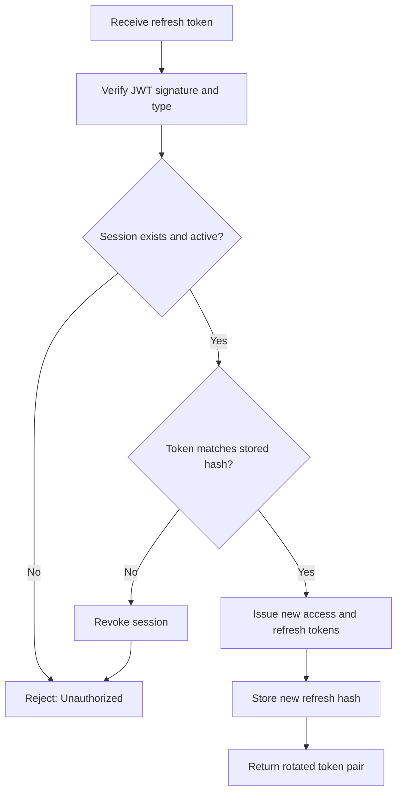
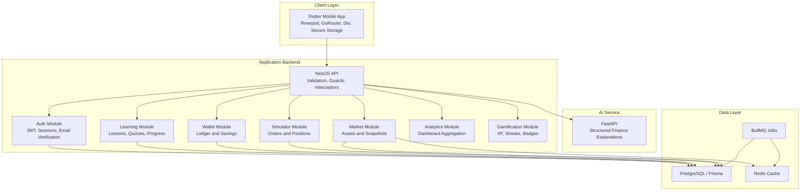
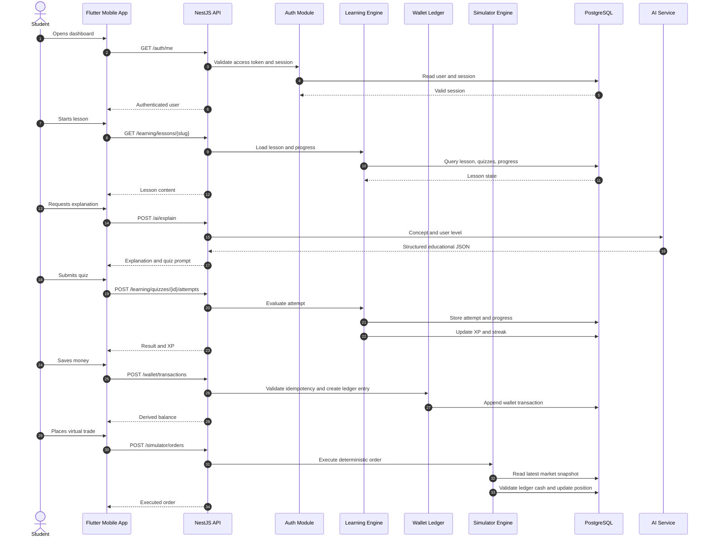
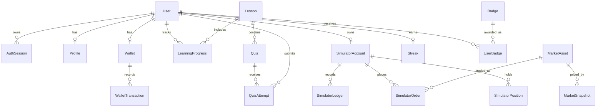
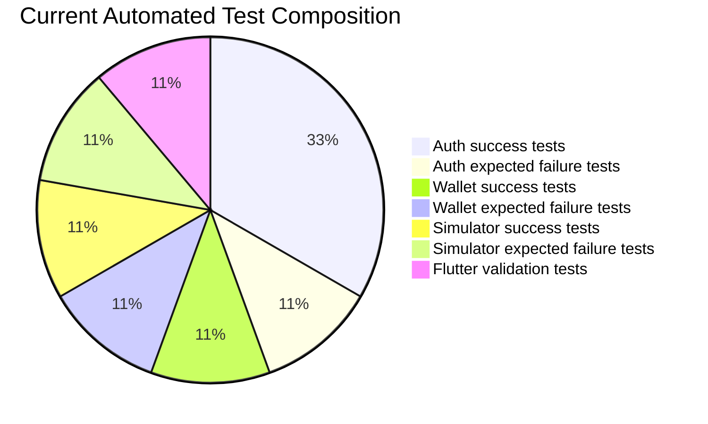
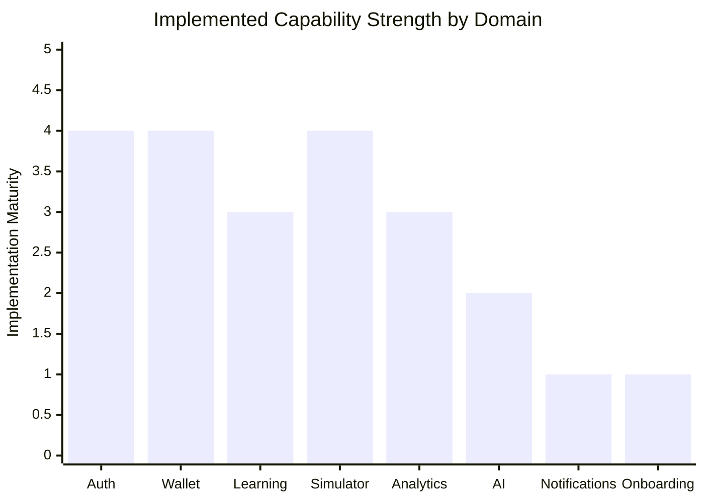
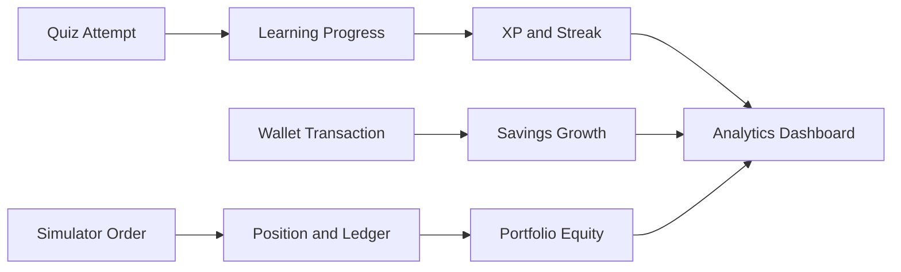

# Muscle Money: Technical Report Supplement

## 1. Product Positioning

Muscle Money is designed as a financial literacy and investment simulation platform for students and young adults. The application combines structured financial education, AI-assisted explanations, gamified learning, simulated investing, wallet-style savings behavior, and analytics. Its purpose is not to replace a banking app, brokerage app, or human financial advisor. Instead, it provides a controlled learning environment where users can practice financial decision-making before interacting with real money.

The system follows a safety-first product boundary:

- AI explains concepts and recommends learning content.
- Deterministic backend services handle wallet logic, quiz scoring, simulator orders, XP, streaks, and analytics.
- Balances are derived from ledger records instead of direct mutation.
- Market prices are read from stored backend snapshots, not directly from the mobile frontend.

## 2. Comparison With Existing Systems

The comparison below is intentionally balanced. Muscle Money is not marked highest in every area because existing products are stronger in some mature categories such as real banking connectivity, live brokerage execution, or broad financial content libraries.

Table formatting note for the final document: keep text horizontally left aligned and vertically middle aligned in all cells.

| Evaluation Area | Finance Blogs / YouTube | Budgeting Apps | Trading Simulators | Generic AI Chatbots | Muscle Money |
| --- | --- | --- | --- | --- | --- |
| Learning structure | Medium. Content is available but usually unstructured. | Low. Education is not the main product. | Low to medium. Focus is trading practice. | Low. Depends on user prompts. | High. Lessons, quizzes, progress, XP, and streaks are linked. |
| Practical simulation | Low. Mostly theoretical. | Medium. Spending categories are practical. | High. Strong trade simulation. | Low. No reliable transaction model. | High. Wallet and investment simulator are connected to learning. |
| Personalization | Low. Same content for all users. | Medium. Based on spending data. | Low. Usually portfolio-only. | Medium to high, but inconsistent. | Medium. Current foundation supports adaptive difficulty and recommendations. |
| Financial safety | Medium. Depends on content quality. | High for tracking, but real data exposure exists. | Medium. Can encourage risky behavior if not guided. | Low to medium. May generate unsafe advice. | High. AI cannot execute money logic or trades. |
| Student suitability | Medium. Accessible but scattered. | Medium. Useful after income/spending starts. | Medium. Often assumes market knowledge. | Medium. Flexible but unguided. | High. Designed around learning, practice, and habits. |
| Real bank/broker integration | None. | High in mature apps. | Low to medium. | None. | Low currently. Planned later because safety and education come first. |
| Analytics depth | Low. | Medium to high. | Medium. Portfolio-focused. | Low. | Medium. Wallet, simulator, and learning analytics are implemented. |
| Current limitation | No interaction. | Not education-first. | Narrow investment focus. | Reliability and safety concerns. | Needs onboarding, external market ingestion, notifications, and integration tests. |

### Feature Coverage Graph

The chart below uses a 0-5 engineering assessment scale. The values are not claims of commercial superiority; they are a structured comparison of feature coverage for this project scope.

```mermaid
xychart-beta
    title "Feature Coverage Comparison (0 = absent, 5 = strong)"
    x-axis ["Learning", "Savings", "Simulation", "Gamification", "AI Safety", "Real Integrations"]
    y-axis "Coverage" 0 --> 5
    bar "Budgeting Apps" [1, 5, 1, 1, 3, 5]
    bar "Trading Simulators" [2, 1, 5, 2, 2, 3]
    bar "Generic AI Chatbots" [3, 0, 0, 0, 1, 0]
    bar "Muscle Money" [4, 3, 4, 4, 4, 1]
```



### Interpretation

Muscle Money scores strongly in education, gamification, AI safety, and simulated practice because those are part of the current architecture. It scores low in real integrations because the present implementation deliberately avoids real banking and brokerage execution. This is a limitation, but also a safety decision for a student-focused learning platform.

## 3. Limitations and Future Scope

| Limitation | Current Impact | Engineering Path Forward |
| --- | --- | --- |
| Signup and onboarding screens are not yet complete | Users cannot yet enter goals, risk profile, or learning preferences in the mobile app | Implement profile/onboarding API and mobile screens after core product APIs |
| No production email provider yet | Email verification token exists, but delivery is not integrated | Add provider abstraction for SES, Resend, or SendGrid |
| Market data ingestion is not automated | Simulator depends on stored snapshots manually inserted through backend API | Add scheduled BullMQ jobs, Redis cache, and snapshot persistence |
| AI service is currently educational-shell level | Safe structure exists, but deeper personalization is limited | Add Gemini integration with strict JSON schemas and safety filters |
| Test coverage is mostly unit-level | Core logic is tested, but database and mobile integration paths need more validation | Add PostgreSQL integration tests and API contract tests |
| No production push notification provider | Notification domain exists only as schema foundation | Add Firebase Cloud Messaging integration |

## 4. Algorithms and Techniques Used

### 4.1 JWT Session and Refresh Rotation Algorithm

1. User submits login credentials.
2. Backend verifies password with Argon2.
3. Backend creates an `auth_sessions` record.
4. Backend issues an access token and refresh token with a session id.
5. Refresh token is hashed before being stored.
6. During refresh, backend verifies the refresh JWT and session id.
7. Backend compares the submitted refresh token against the stored hash.
8. If valid, a new refresh token is issued and the stored hash is replaced.
9. If an old refresh token is reused, the session is revoked.



### 4.2 Wallet Ledger Balance Algorithm

1. Every wallet event is stored as a transaction row.
2. Credit entries add value.
3. Debit entries subtract value.
4. Balance is calculated by summing all ledger rows.
5. Idempotency key prevents duplicate transaction creation.

Formula:

```text
wallet_balance = sum(credit_amounts) - sum(debit_amounts)
```

### 4.3 Simulator Order Execution Algorithm

1. User submits virtual order request.
2. Backend loads simulator account.
3. Backend loads latest stored market snapshot for the selected asset.
4. Backend rejects trade if no snapshot exists.
5. For buy orders, backend checks available simulator cash from ledger.
6. For sell orders, backend checks available position quantity.
7. Backend creates simulator order.
8. Backend appends simulator ledger entry.
9. Backend updates or deletes simulator position.

### 4.4 Quiz Evaluation and Gamification Algorithm

1. User submits selected answer options.
2. Backend sorts selected answers and stored answer key.
3. Backend compares normalized arrays.
4. Correct answers receive XP according to lesson difficulty.
5. Backend updates learning progress.
6. Backend updates streak and gamification summary.

## 5. UML Diagrams

### 5.1 System Architecture Diagram



### 5.2 Sequence Diagram: Learning, Saving, and Simulation Flow



### 5.3 Core Data Relationship Diagram



## 6. Software Requirements

Table formatting note: left align text and vertically middle align cells in the final Word/PDF document.

| Requirement ID | Requirement | Type | Priority | Implementation Status | Evidence |
| --- | --- | --- | --- | --- | --- |
| FR-01 | Users must authenticate securely using JWT access tokens and refresh token rotation. | Functional | High | Implemented | `AuthService`, `AuthSession`, auth tests |
| FR-02 | The wallet must calculate balance from ledger entries, not direct mutation. | Functional | High | Implemented | `WalletService`, wallet tests |
| FR-03 | Users must be able to practice investment decisions in a simulator. | Functional | High | Implemented | `SimulatorService`, simulator tests |
| FR-04 | Simulator orders must use backend-stored market snapshots. | Functional | High | Implemented | `MarketService`, `SimulatorService` |
| FR-05 | Lessons and quizzes must update user progress. | Functional | Medium | Implemented | `LearningService` |
| FR-06 | Correct quiz attempts must award XP and update streaks. | Functional | Medium | Implemented | `GamificationService` |
| FR-07 | Dashboard analytics must show wallet, simulator, and learning indicators. | Functional | Medium | Implemented | `AnalyticsService` |
| NFR-01 | Secrets must not be hardcoded. | Non-functional | High | Implemented | Environment validation |
| NFR-02 | API inputs must be validated. | Non-functional | High | Implemented | DTOs and global validation pipe |
| NFR-03 | Financial operations must be auditable and deterministic. | Non-functional | High | Partially implemented | Ledger entries and auth audit logs |
| NFR-04 | The mobile app must handle loading and error states. | Non-functional | Medium | Partially implemented | Auth controller and sign-in screen |
| NFR-05 | The system must support future scaling. | Non-functional | Medium | Foundation implemented | Modular NestJS, Redis, BullMQ, Prisma |

## 7. Test Cases: Successful and Expected Failure Scenarios

The test suite is not designed to show that every action always succeeds. A reliable fintech application must also reject invalid, unsafe, or duplicate actions. Therefore, the implemented tests include both passing workflows and expected failure cases.

| Test Group | Scenario | Expected Result | Interpretation |
| --- | --- | --- | --- |
| Auth | Register user creates verification token and session | Pass | Basic account creation flow works. |
| Auth | Refresh token rotation replaces stored hash | Pass | Session renewal follows secure rotation. |
| Auth | Reused refresh token | Expected failure: Unauthorized | Replay/theft protection works. |
| Auth | Valid email verification token | Pass | Email verification token can be consumed. |
| Wallet | Ledger credits and debits derive balance | Pass | Balance is calculated from immutable entries. |
| Wallet | Duplicate idempotency key | Expected failure: Conflict | Prevents duplicate wallet credit. |
| Simulator | Buy order with enough virtual cash | Pass | Simulator can execute snapshot-priced trade. |
| Simulator | Buy order with insufficient cash | Expected failure: BadRequest | Simulator blocks impossible trade. |
| Mobile | Empty sign-in form | Expected validation messages | UI rejects invalid user input. |



## 8. Results and Discussion

### 8.1 Current Implementation Metrics

| Metric | Value |
| --- | ---: |
| Implemented backend API domains | 7 |
| Core ledger systems | 2 |
| Backend unit tests | 8 |
| Flutter widget tests | 1 |
| High-severity npm audit findings | 0 |
| Prisma-backed domain models | 24+ |
| Implemented failure scenarios in automated tests | 3 backend + 1 mobile validation |

### 8.2 Product Capability Distribution



Interpretation:

- Auth is relatively mature because it includes refresh rotation, hashed sessions, logout, email verification token logic, and tests.
- Wallet and simulator are strong at the service level because they use ledger-based deterministic calculations.
- Learning and analytics are functional but still need richer content seeding and personalization.
- AI service has safe structure but still needs deeper model integration and contract tests.
- Notifications and onboarding are intentionally left for the next phase.

### 8.3 Data Flow From User Action to Dashboard Insight



### 8.4 Discussion Points

- The most important engineering decision is the ledger-first model. It reduces the risk of inconsistent balances because wallet and simulator balances are derived from transaction history.
- The simulator does not execute trades from live frontend prices. It reads backend market snapshots, which gives the backend control over pricing, validation, caching, and auditability.
- The current test suite includes failure cases because production systems must prove that invalid operations are rejected.
- Muscle Money is stronger than generic learning content because the learning, practice, savings, and analytics loops are connected.
- Muscle Money is weaker than mature banking apps in real financial integrations, which is acceptable at this stage because the product is a learning and simulation platform.

## 9. Conclusion With Numerical Result Analysis

The current implementation demonstrates a working product foundation rather than only a conceptual design. Seven backend API domains are implemented: authentication, wallet, learning, gamification, market, simulator, and analytics. The backend contains eight unit tests, including expected failure cases for token replay, duplicate wallet idempotency, and insufficient simulator cash. The mobile app includes one widget test for form validation.

Numerically, the project currently has:

- 7 implemented API domains.
- 2 ledger-based financial systems.
- 8 backend tests.
- 1 Flutter widget test.
- 0 high-severity npm audit findings.
- 3 backend failure scenarios covered by tests.

These results show that the application has moved beyond a static prototype. It now supports measurable learning progress, derived savings balances, deterministic simulator trades, and dashboard analytics. The next measurable goals should be:

| Next Metric | Target |
| --- | ---: |
| Backend integration tests | 15+ |
| Mobile feature screens | 6+ |
| Onboarding completion flow | 100% implemented |
| AI JSON contract tests | 5+ |
| Market ingestion jobs | 2 scheduled jobs |
| Notification event types | 4+ |

The main conclusion is that Muscle Money is technically feasible and already has the core engineering foundation required for a fintech learning simulator. However, real-world readiness will require integration testing, production communication providers, external market ingestion, richer AI personalization, and complete mobile workflows.
