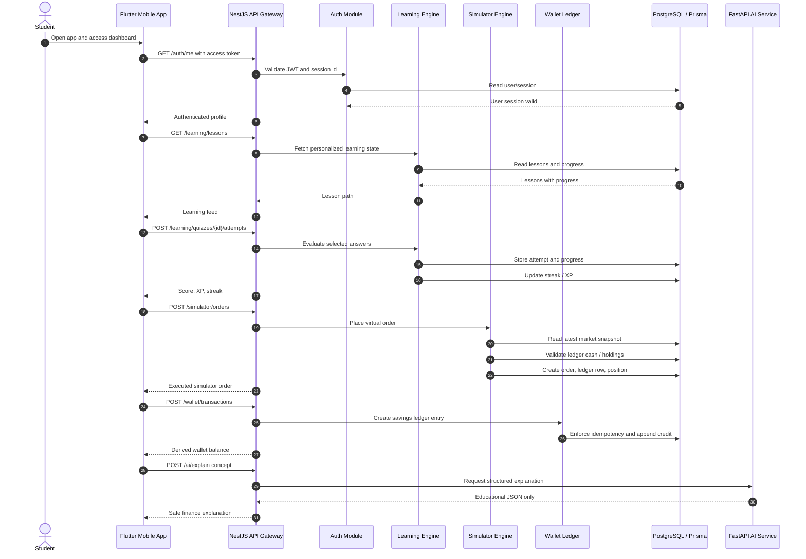
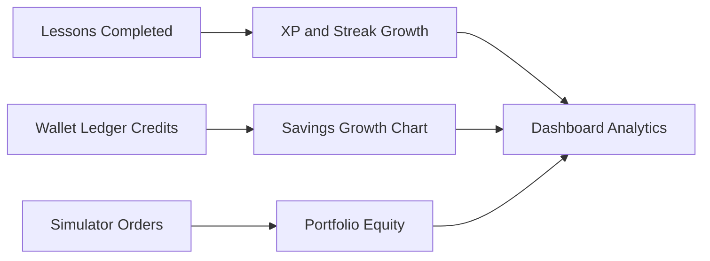

# Muscle Money Submission Notes

This note tracks the report/presentation items that must be reflected after the product implementation work.

For the polished report draft with graphs, UML diagrams, balanced comparison, result discussion, and numerical conclusion, use [professional-report-supplement.md](professional-report-supplement.md).

## 4. Comparison and Limitations of Existing Systems

Highlight expected comparison points:

| Existing System | Strength | Limitation | Muscle Money Response |
| --- | --- | --- | --- |
| Basic finance blogs | Easy to access | Passive content, no personalization | Adaptive lessons and quizzes |
| Trading simulators | Good market practice | Weak learning context and little savings behavior | Simulator plus learning plus wallet ledger |
| Budgeting apps | Useful tracking | Often bank-data dependent and not student-first | Simulated auto-save rules and education-first UX |
| Generic AI chatbots | Flexible explanations | Unsafe for direct money decisions | AI only explains and recommends learning content |

Keep table text left aligned and vertically middle aligned in the final document.

## 5. Algorithms and Techniques Used

Stepwise techniques to describe:

1. User session algorithm: validate JWT access token, bind it to a persisted session id, rotate refresh tokens, revoke on reuse.
2. Wallet ledger algorithm: append immutable debit/credit rows, calculate current balance by summing ledger directions, reject duplicate idempotency keys.
3. Quiz evaluation algorithm: normalize selected answers and answer key, compare sorted arrays, award XP only for correct attempts.
4. Adaptive progress algorithm: update lesson progress from quiz outcomes and use XP/streaks to drive gamification state.
5. Simulator order algorithm: read latest stored market snapshot, validate cash/holding sufficiency, create order, append simulator ledger row, update position.
6. Analytics aggregation algorithm: derive wallet growth series, simulator equity, quiz accuracy, completed lessons, and XP from transactional tables.
7. AI safety technique: restrict AI service to structured educational JSON; deterministic backend modules own balances, trades, and rules.

## 6. Sequence Diagram

Use this UML-style Mermaid diagram as the base. Export it from a UML/Mermaid tool for the final document.

## 7. Software Requirements Table

Use left-middle alignment for all table text in the final document.

| Requirement Type | Requirement | Current Implementation Evidence |
| --- | --- | --- |
| Functional | JWT authentication and refresh rotation | `AuthService`, `AuthSession`, auth tests |
| Functional | Wallet ledger and auto-save foundation | `WalletService`, wallet tests |
| Functional | Investment simulator | `SimulatorService`, simulator tests |
| Functional | Learning and gamification | `LearningService`, `GamificationService` |
| Functional | Analytics dashboard | `AnalyticsService` |
| Non-functional | Security | Helmet, validation pipe, hashed tokens, audit logs |
| Non-functional | Maintainability | Feature modules, DTO validation, repository boundaries |
| Non-functional | Reliability | Idempotency keys and explicit failure tests |

## 8. Pass and Fail Test Cases

Do not claim all tests always pass. Explain that the automated suite includes both successful outcomes and expected failure scenarios.

| Test Case | Expected Result | Why It Matters |
| --- | --- | --- |
| Register user creates session | Pass | Auth happy path works |
| Refresh token rotates hash | Pass | Session renewal works |
| Reused refresh token | Expected fail with Unauthorized | Detects token theft / replay |
| Duplicate wallet idempotency key | Expected fail with Conflict | Prevents double-crediting wallet |
| Simulator buy with enough cash | Pass | Trading happy path works |
| Simulator buy with insufficient cash | Expected fail with BadRequest | Prevents impossible virtual trades |

Future challenge to mention: expand tests to database integration, market refresh jobs, mobile API integration, and AI JSON contract validation.

## 9. Results and Discussion

Graphical structures to include:

Discussion key points:

- Ledger architecture prevents direct balance mutation.
- Refresh-token reuse detection improves session security.
- Simulator trades are deterministic because execution depends on stored market snapshots.
- Learning progress, quiz accuracy, XP, and streaks are measurable from persisted records.
- The current system is ready for integration testing but still needs production email delivery, push notifications, and external market ingestion jobs.

## 11. Conclusion With Numerical Analysis

Current implementation numbers to report:

| Metric | Current Value |
| --- | ---: |
| Backend product modules implemented | 6 |
| Auth/session unit tests | 4 |
| Wallet unit tests | 2 |
| Simulator unit tests | 2 |
| Total backend tests | 8 |
| Flutter widget tests | 1 |
| npm high-severity audit findings | 0 |
| Core ledger systems | 2 |
| Implemented API domains | Auth, Wallet, Learning, Gamification, Market, Simulator, Analytics |

Conclusion angle: Muscle Money has moved from architecture scaffold to working product foundation with measurable auth, ledger, simulator, learning, and analytics behavior. The next numerical milestone should target integration coverage, onboarding completion rate, quiz accuracy trends, simulator ROI, and savings growth over time.
